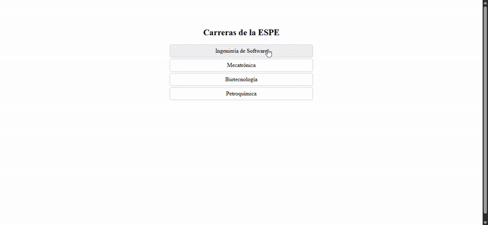

# Visualizador de Carreras - Examen U2 John Galarza

Este proyecto permite al usuario seleccionar y visualizar informacion detallada de carreras ofertadas por la ESPE. Se compone de dos Web Components interactivos y estilizados dinamicamente: `<career-selector>` y `<career-card>`.

---

## Estructura del Proyecto
```
/src
├── /components
│ ├── career-card.js
│ └── career-selector.js
├── /styles
│ └── themes.js
├── /data
│ └── carreras.json
└── index.html
```

## Instrucciones clonar

### Clonar el repositorio

```bash
git clone https://github.com/tu-usuario/nombre-repo.git
cd nombre-repo
```
### Instalar dependencias
```bash
npm install
```
### Ejecutar el proyecto
```bash
npm run dev
```


## Componentes

### `<career-selector>`

Lista las carreras disponibles a partir del archivo `carreras.json` y emite un evento personalizado cuando el usuario selecciona una.

#### Propiedades

| Propiedad | Tipo   | Descripción                                 |
|-----------|--------|---------------------------------------------|
| carreras  | Array  | Lista de carreras cargadas dinámicamente    |

#### Eventos

| Evento            | Descripción                                |
|-------------------|--------------------------------------------|
| `career-selected` | Emite los datos completos de la carrera seleccionada |

#### Uso

```html
<career-selector></career-selector>
```

### `<career-card>`
Muestra la información de una carrera seleccionada en un modal estilizado según el último dígito de la cédula del usuario.

#### Propiedades

| Propiedad | Tipo   | Descripción                                          |
| --------- | ------ | ---------------------------------------------------- |
| carrera   | Object | Objeto con datos de la carrera seleccionada          |
| digito    | Number | Último dígito de cédula para aplicar tema de colores |
| tema      | String | Tema calculado dinámicamente (interno)               |

#### Temas por dígito
| Dígito | Tema    | Significado                |
| ------ | ------- | -------------------------- |
| 0, 1   | Azul    | Colores institucionales    |
| 2, 3   | Verde   | Naturaleza, agronomía      |
| 4, 5   | Rojo    | Energía, mecatrónica       |
| 6, 7   | Gris    | Tecnología, software       |
| 8, 9   | Naranja | Innovación, emprendimiento |

#### Uso
```
<career-card digito="5" .carrera=${carrera}></career-card>
```

##  Capturas
Componente en accion con digito 5:

