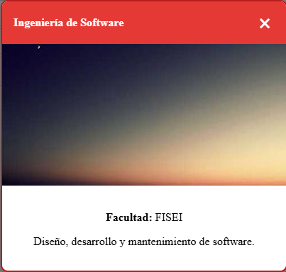

## Componente modal `<career-card>`

Componente que muestra informacion detallada de una carrera universitaria de la ESPE en un modal con tema dinamico segun el digito de la cedula que le manden.

### Propidades

| Propiedad | Tipo   | Descripcion                                        |
|-----------|--------|----------------------------------------------------|
| carrera   | Object | Datos de la carrera seleccionada                   |
| digito    | Number | Ultimo digito de la cedula para aplicar el tema    |
| tema      | String | (Interna) Tema visual generado por el digito       |

### Uso

```html
<career-card digito="7"></career-card>
```

## Capturas
Se muestra como se visualiza el componente modal cuando esta desplegado

