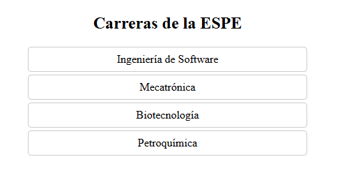

## Selector de Carrera `<career-selector>`

Muestra un listado de carreras y emite un evento cuando el usuario selecciona una.

### Props

| Propiedad | Tipo   | Descripción                            |
|-----------|--------|----------------------------------------|
| carreras  | Array  | Lista de carreras cargadas del JSON    |

### Eventos

| Evento            | Descripción                                |
|-------------------|--------------------------------------------|
| `career-selected` | Se emite al hacer clic en una carrera.     |

### Uso

```html
<career-selector></career-selector>
```

## Capturas
Se muestra como se visualiza el componente de seleccionar

